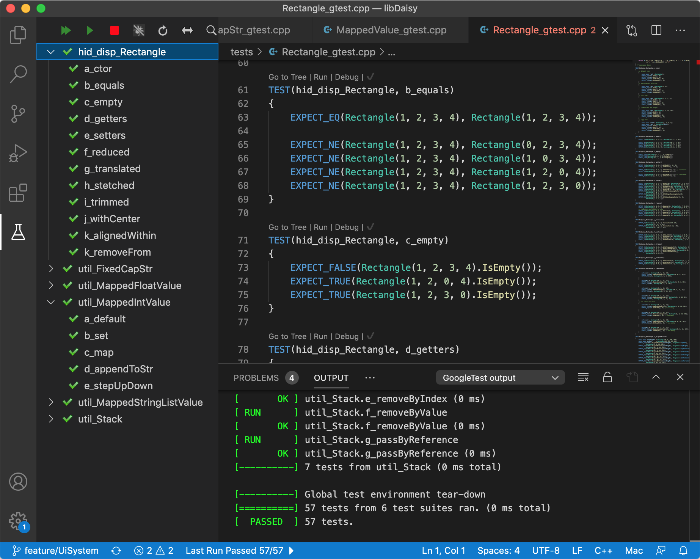

# Development - Unit-Testing

libDaisy has integrated unit tests.

- Unit tests are small tests that verify that a piece of code works as intended.
- Unit tests are compiled into a small application that runs on your development computer. They're not compiled into libDaisy.
- Unit tests are run as part of the continuous integration (CI) setup. They're build and executed with each pull request, making sure that the changes don't break existing functionality.
- Unit tests in libDaisy are based on the widely used [googletest framework](https://google.github.io/googletest/primer.html)

## Why write tests?

Writing a test can help you in many ways. Here are some of the many benefits:

- With unit tests in place, we can modify existing code without fear. If there's a test and its green, you can feel safe.
- Unit tests give you a great, simple environment to quickly run and test your code with a debugger. Not only does a test work independently from the hardware, it also gives you a clean, blank slate that's easy to setup so that you can quickly check out a particular scenario. Want to quickly try out that idea you had earlier? No need to setup a hardware testbed! Just add a small test and off you go!
- In writing the tests for new code, you force yourself to really think about what your code is supposed and not supposed to do. This helps you split a new functionality into small, independent parts that serve a well defined purpose. Additionally, the test itself is the best documentation. It clearly states how the code should behave.

## How to run tests?

Update the git submodules so that the googletest code is checked out.

    > git submodule update --init --recursive

Linux:

- Install the `build-essential` package. That's it.

macOS:

- Install Xcode and the Xcode commandline tools.

Windows:

- Install Cygwin with the packages `g++`, `gdb` and `make`. Add them to your PATH environment variable. [This guide may be helpful for you](https://www.cs.odu.edu/~zeil/cs250PreTest/latest/Public/installingACompiler/#installing-the-cygwin-compiler).

### From the commandline

All tests live in the `tests/` directory and share a common makefile. To build and run the tests, execute this:

```
> cd tests/
> make test
```
This generates and runs a small commandline program `tests/libDaisy_gtest`.

### From Visual Studio Code

Programmers using Visual Studio Code can install the recommended extensions (you will be prompted to do so) and use the test panel to directly run the tests. Take a look at the screenshot below:



- Build tests by executing the `build-libDaisy-tests` task with `Ctrl-Shift-B` (Win) or `Cmd-Shift-B` (macOS).
- Run and debug individual tests or entire test suites from the test panel. (see screenshot)
- Launch the tests from the launch tab with the `Launch Tests Locally` launch configuration.

## Getting started with unit testing

Adding a new test to libDaisy is easy.

1. Add a new `*_gtest.cpp` file to the `tests/` directory. This is where you will write your tests. It makes sense to create individual files for each component you want to test.
2. In this file, include the googletest header `#include <gtest/gtest.h>`
3. Also include the code you want to test `#include "myHeaderFileFromLibDaisy.h"`
4. If your code also has a `*.cpp` file, include that in the file `tests/libDaisyImpls.cpp` like this: `#include "myCppFileFromLibDaisy.cpp"`
5. Add a test to your fresh new `*_gtest.cpp` file.

This is what a simple test could look like:

```cpp
// tests/myTest_gtest.cpp
#include <gtest/gtest.h>
#include "myHeaderFileFromLibDaisy.h"

TEST(MyTestSuiteName, a_myFirstTest)
{
    EXPECT_EQ(2, 6 - 4);
}

TEST(MyTestSuiteName, b_mySecondTest)
{
    const bool someResult = 2 == 2;
    EXPECT_TRUE(someResult);
}
```

For more examples, check out the existing tests and take a look at the [official googletest primer](https://google.github.io/googletest/primer.html).

## Drawbacks & things to watch out for

Tests are built locally on your development computer. While that enables you to build and test without hardware, it comes with a couple of drawbacks that you should be aware of:

- Any code that uses features specific to the hardware can't be unit tested. This includes
  - Code that uses inline assembly
  - Code that relies on hardware peripherals
- The unit test makefile is setup so that the `UNIT_TEST` macro is defined whenever code is compiled for unit tests. You can use this to replace actual hardware dependent code with a dummy version.
  - Let's assume you want to write tests for `src/hid/led.h`.
  - This file will include `src/per/gpio.h` which obviously can't work natively on your development computer.
  - To resolve this issue, you could use the preprocessor macro `UNIT_TEST` to selectively replace the problematic gpio code with a dummy version that you can control and observe from your unit tests.

Should you face issues with native code that won't compile in unit tests, feel free to ask on the [forums](https://forum/electro-smith.com) or in [Slack](https://join.slack.com/t/es-daisy/shared_invite/zt-f9cfm1g4-DgdCok1h1Rj4fpX90~IOww)! We're there to help!
